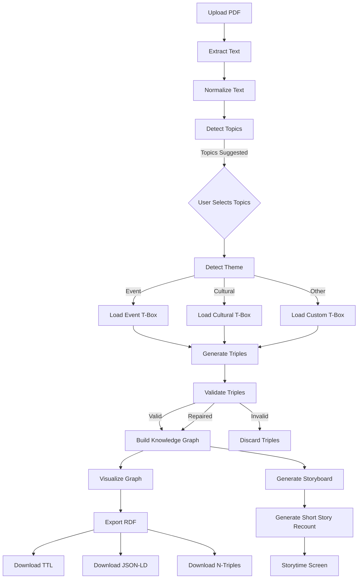

```mermaid
flowchart TD

    A[Upload PDF] --> B[Extract Text]
    B --> C[Normalize Text]

    C --> D[Detect Topics]
    D -->|Topics Suggested| E{User Selects Topics}

    E --> F[Detect Theme]
    F -->|Event| G[Load Event T-Box]
    F -->|Cultural| H[Load Cultural T-Box]
    F -->|Other| I[Load Custom T-Box]

    G --> J[Generate Triples]
    H --> J
    I --> J

    J --> K[Validate Triples]
    K -->|Valid| L[Build Knowledge Graph]
    K -->|Repaired| L
    K -->|Invalid| M[Discard Triples]

    L --> N[Visualize Graph]
    N --> O[Export RDF]

    O --> P[Download TTL]
    O --> Q[Download JSON-LD]
    O --> R[Download N-Triples]
   %% ===== Storytime Feature =====
    L --> S1[Generate Storyboard]
    S1 --> S2[Generate Short Story Recount]
    S2 --> S3[Storytime Screen]
```
