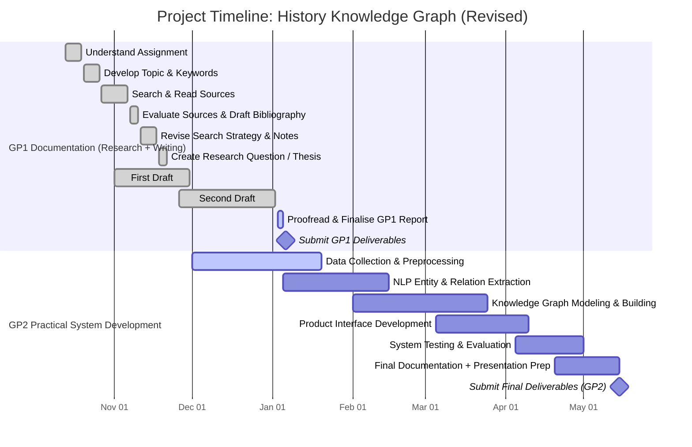

# ChronoLearn
### Graduation Project — Data Science & Artificial Intelligence

**Authors:** Mohammad ALADDASI & Shahd Abu Hijleh

**Supervisor:** *Dr Omar Qawasmeh*
 
**Institution:** *Princess Summaya University for Technology*

**Academic Year:** 2025–2026

---

## Project Overview

ChronoLearn is an AI-powered educational platform designed to transform how history, specifically the Jordanian and Palestinian history, is accessed, explored, and understood. The project addresses the limitations of traditional, text-heavy history learning methods by introducing an interactive, visual, and explainable system built on Knowledge Graphs (KGs) and Large Language Models (LLMs).

The platform ingests historical documents from multiple sources and formats, processes them through an ETL-based NLP pipeline, and converts them into a structured semantic Knowledge Graph representing people, events, locations, organisations, and time periods. This structured representation serves as a grounding layer for LLM-based semantic querying, enabling accurate, context-aware, and explainable historical exploration.

ChronoLearn places a strong emphasis on Arabic historical narratives, filling a critical gap in existing digital history platforms and supporting learners, educators, and researchers through KG visualisation, AI-generated story narratives, and interactive exploration tools.

---

## Research Question

> **How can a KG integration with LLM provide an interactive way to represent history discipline in an educational manner compared to traditional text-based representations?**

---

## Objectives

* Build a **Knowledge Graph** representing entities and their relationships.
* Design an **ETL/ELT pipeline** for ingesting structured and unstructured  data.
* Integrate **natural language processing (NLP)** for entity extraction and relation identification.
* Implement a **smart query system** for semantic exploration and reasoning.
* Evaluate system performance through query relevance and reasoning accuracy.
  
* Design and construct a **history-oriented Knowledge Graph** representing entities and relationships within Jordanian and Palestinian historical narratives.
* Develop an **ETL-based NLP pipeline** capable of processing Arabic historical texts from diverse sources and formats.
* Integrate **LLM-assisted entity and relation extraction** to support accurate and explainable knowledge representation.
* Provide **interactive educational outputs**, including KG visualisations, narrative story tale and story board generations.
* Evaluate the system’s effectiveness in terms of **accuracy, explainability, usability, and educational value** compared to traditional text-based approaches.
---

## Methodology

1. **Data Collection & Preprocessing** – Historical documents are collected from open-access Arabic sources (PDFs, webpages, articles, archives) and preprocessed through text cleaning, normalisation, and segmentation..
2. **Entity & Relation Extraction** – NLP and LLM-based techniques are applied for Named Entity Recognition (NER), relation extraction (RE), and semantic role labelling to identify historical entities and their relationships.
3. **Knowledge Graph Construction** – Extracted entities and relationships are modelled and stored in a KG using Neo4j or RDF-based representations, ensuring canonicalisation and source traceability.
4. **KG-Grounded LLM Integration** – The Knowledge Graph is used as a grounding layer for LLM-based reasoning, narrative generation, and semantic question answering to reduce hallucinations and improve explainability.
5. **Interactive Interface & Visualisation** –  A web-based interface allows users to explore the Knowledge Graph, generate historical story tales, and storyboard representations.
6. **Testing & Evaluation** – The system is evaluated using qualitative expert feedback and quantitative metrics such as precision, recall, and query accuracy, focusing on educational effectiveness and reliability.
---

## Technologies

| **Component**        | **Tools / Technologies**                            |
| -------------------- | --------------------------------------------------- |
| **Programming**      | Python, Jupyter Notebook                            |
| **NLP & Arabic NLP** | Omartificial, CAMeL Toolkit                         |
| **Knowledge Graph**  | Neo4j or RDFLib (RDF / OWL)                         |
| **Vector Store**     | ChromaDB                                            |
| **Data Pipeline**    | Pandas, BeautifulSoup, Selenium                     |
| **LLM Models**       | Aya Model, Qwen, OSS2b *(if feasible)*              |
| **Evaluation**       | Precision / Recall, HITS@K, SPARQL Queries, Cypher  |
| **Visualisation**    | Cytoscape.js, Vis Network (Vis.js), Sigma.js, D3.js |
| **Frontend (UI)**    | HTML, TypeScript (TSX), JavaScript                  |
| **Backend**          | Flask (Python API)                                  |

## Project Timeline (Gantt Chart)

## Deliverables

* **Graduation Research Report (GP1 & GP2)** documenting analysis, design, implementation, and evaluation.
* **Functional Prototype** of an AI-powered Knowledge Graph–based history learning platform.
* **Interactive** Knowledge Graph Visualisations, AI-generated historical storyboards and story tales.
* **Evaluation & Testing Report** assessing system accuracy, usability, and educational impact.
* **User Manual** explaining platform usage and features.
* **Final Presentation Slides** for technical and non-technical audiences.

---

## Citation & Resources
* If you use this project or its ideas, please cite appropriately.
This repository follows the [IEEE]([https://ieee-dataport.org/sites/default/files/analysis/27/IEEE%20Citation%20Guidelines.pdf]) citation format.
---

## Acknowledgments

Special thanks to the **Data Science & AI Department**; especially, **Dr Omar Qawasmeh** for guidance and resources.
