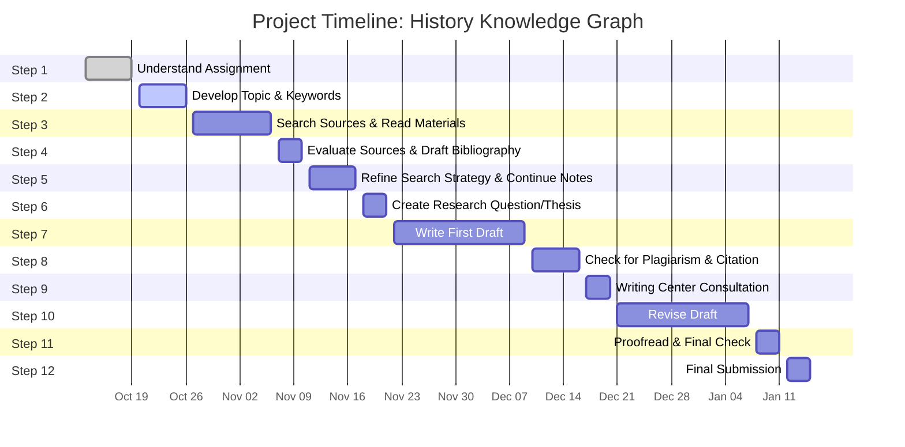

# History-Smart-Search-Engine
# Knowledge Graph for Smart Search Engine

### Graduation Project — Data Science & Artificial Intelligence

**Authors:** Mohammad ALADDASI & Shahd Abuhijleh
**Supervisor:** *Dr Omar Qawasmeh*
**Institution:** *Princess Summaya University for Technology*
**Academic Year:** 2025–2026

---

## Project Overview

This project aims to develop a **history-based Knowledge Graph (KG)** that can power a **frontend** capable of reasoning, linking, and contextualizing historical information. The system will extract structured knowledge from diverse sources (texts, timelines, archives) to create a semantic network of **events, people, places, and time periods**.

The project bridges **data science**, **NLP**, and **knowledge representation** — providing an intelligent exploration tool for historical research, education, and cultural preservation.

---

## Research Question

> **How can a history-based Knowledge Graph improve contextual understanding and intelligent information retrieval compared to traditional keyword-based search engines?**

---

## Objectives

* Build a **Knowledge Graph** representing entities and their relationships.
* Design an **ETL/ELT pipeline** for ingesting structured and unstructured  data.
* Integrate **natural language processing (NLP)** for entity extraction and relation identification.
* Implement a **smart query system** for semantic exploration and reasoning.
* Evaluate system performance through query relevance and reasoning accuracy.

---

## Methodology

1. **Data Collection** – Scrape and preprocess texts from open-access archives and APIs.
2. **Entity & Relation Extraction** – Use NLP pipelines for named entity recognition (NER) and dependency parsing.
3. **Knowledge Graph Construction** – Build and populate using RDF/OWL or Neo4j.
4. **Query Interface** – Develop a front-end or command-line interface for semantic search.
5. **Evaluation** – Compare with keyword-based search performance on historical questions.

---

## Technologies

| Component       | Tools                            |
| --------------- | -------------------------------- |
| Programming     | Python, Jupyter                  |
| NLP             | spaCy, Transformers              |
| Knowledge Graph | Neo4j, RDFLib                    |
| Vector Store    | Weaviate                         |
| Data Pipeline   | Pandas, BeautifulSoup, Scrapy    |
| LLM Models      | Aya Model, qwen, omartificial    |
| Evaluation      | Precision/Recall, SPARQL queries |
| Visualization   | NetworkX, Plotly                 |

---

## Project Timeline (Gantt Chart)

---

## Deliverables

* Research Paper (APA7 Format)
* Functional Prototype of the Knowledge Graph Search Engine
* Evaluation Report
* Presentation Slides

---

## Citation & Resources

If you use this project or its ideas, please cite appropriately.
This repository follows the [APA 7th Edition](https://apastyle.apa.org/) citation format.
---

## Acknowledgments

Special thanks to the **Data Science & AI Department** especially **Dr Omar Qawasmeh** for guidance and resources.
