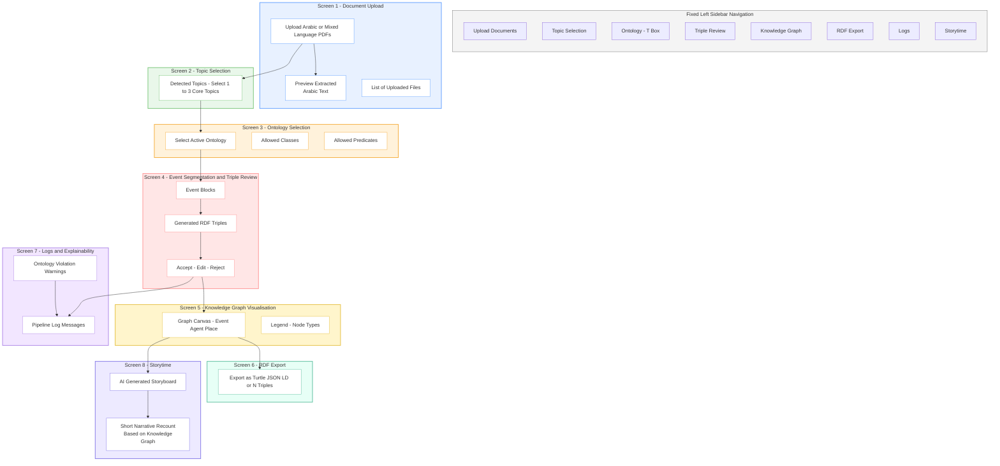

```mermaid
flowchart TB

%% ================= LEFT SIDEBAR =================

subgraph Sidebar[Fixed Left Sidebar Navigation]
direction TB
S1["Upload Documents"]
S2["Topic Selection"]
S3["Ontology - T Box"]
S4["Triple Review"]
S5["Knowledge Graph"]
S6["RDF Export"]
S7["Logs"]
S8["Storytime"]
end


%% ================= SCREENS =================

subgraph U1[Screen 1 - Document Upload]
DU["Upload Arabic or Mixed Language PDFs"]
PR["Preview Extracted<br/>Arabic Text"]
UL["List of Uploaded Files"]
end

subgraph U2[Screen 2 - Topic Selection]
TS["Detected Topics - Select 1 to 3 Core Topics"]
end

subgraph U3[Screen 3 - Ontology Selection]
TBX["Select Active Ontology"]
ACL["Allowed Classes"]
APD["Allowed Predicates"]
end

subgraph U4[Screen 4 - Event Segmentation and Triple Review]
EV["Event Blocks"]
TR["Generated RDF Triples"]
AR["Accept - Edit - Reject"]
end

subgraph U5[Screen 5 - Knowledge Graph Visualisation]
GV["Graph Canvas - Event Agent Place"]
LG["Legend - Node Types"]
end

subgraph U6[Screen 6 - RDF Export]
EX["Export as Turtle JSON LD or N Triples"]
end

subgraph U7[Screen 7 - Logs and Explainability]
LGX["Pipeline Log Messages"]
WRN["Ontology Violation Warnings"]
end

subgraph U8[Screen 8 - Storytime]
SB["AI Generated Storyboard"]
ST["Short Narrative Recount<br/> Based on Knowledge Graph"]
end


%% ================= PIPELINE FLOW =================

DU --> PR
DU --> TS
TS --> TBX
TBX --> EV
EV --> TR
TR --> AR
AR --> GV
GV --> EX
AR --> LGX
WRN --> LGX
GV --> SB
SB --> ST


%% ================= COLORS PER SCREEN =================

style Sidebar fill:#F4F4F4,stroke:#777,stroke-width:1px

style U1 fill:#E8F1FF,stroke:#6AA5FF,stroke-width:2px
style DU fill:#FFFFFF,stroke:#6AA5FF
style PR fill:#FFFFFF,stroke:#6AA5FF
style UL fill:#FFFFFF,stroke:#6AA5FF

style U2 fill:#E9F7EA,stroke:#7EC87E,stroke-width:2px
style TS fill:#FFFFFF,stroke:#7EC87E

style U3 fill:#FFF2DB,stroke:#F5B043,stroke-width:2px
style TBX fill:#FFFFFF,stroke:#F5B043
style ACL fill:#FFFFFF,stroke:#F5B043
style APD fill:#FFFFFF,stroke:#F5B043

style U4 fill:#FFE6E6,stroke:#FF9A9A,stroke-width:2px
style EV fill:#FFFFFF,stroke:#FF9A9A
style TR fill:#FFFFFF,stroke:#FF9A9A
style AR fill:#FFFFFF,stroke:#FF9A9A

style U5 fill:#FFF5CC,stroke:#E6C24A,stroke-width:2px
style GV fill:#FFFFFF,stroke:#E6C24A
style LG fill:#FFFFFF,stroke:#E6C24A

style U6 fill:#E7FFF6,stroke:#66C2A4,stroke-width:2px
style EX fill:#FFFFFF,stroke:#66C2A4

style U7 fill:#F2E6FF,stroke:#B18BE8,stroke-width:2px
style LGX fill:#FFFFFF,stroke:#B18BE8
style WRN fill:#FFFFFF,stroke:#B18BE8

style U8 fill:#EDEAFF,stroke:#8A7FE8,stroke-width:2px
style SB fill:#FFFFFF,stroke:#8A7FE8
style ST fill:#FFFFFF,stroke:#8A7FE8
```
