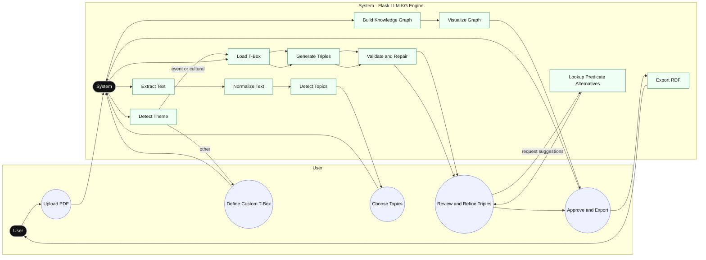

```mermaid
flowchart LR

%% =======================
%% Swimlanes
%% =======================

subgraph ULane["User"]
direction TB
U([User])
UC1((Upload PDF))
UC2((Choose Topics))
UC3((Define Custom T-Box))
UC4((Review and Refine Triples))
UC5((Approve and Export))
end

subgraph SLane["System - Flask LLM KG Engine"]
direction TB
S([System])
SC1[Extract Text]
SC2[Normalize Text]
SC3[Detect Topics]
SC4[Detect Theme]
SC5[Load T-Box]
SC6[Generate Triples]
SC7[Validate and Repair]
SC8[Build Knowledge Graph]
SC9[Visualize Graph]
SC10[Export RDF]
SC11[Lookup Predicate Alternatives]
end

%% =======================
%% Interactions
%% =======================

U --> UC1 --> S
S --> SC1 --> SC2 --> SC3 --> UC2

UC2 --> S --> SC4

SC4 -->|event or cultural| SC5 --> SC6 --> SC7 --> UC4
SC4 -->|other| UC3 --> S --> SC5 --> SC6 --> SC7 --> UC4

UC4 -->|request suggestions| SC11 --> UC4

UC4 --> UC5 --> S
S --> SC8 --> SC9 --> UC5
UC5 --> SC10 --> U

%% =======================
%% Styling
%% =======================

classDef actor fill:#111,stroke:#aaa,color:#fff,stroke-width:1px;
classDef usercase fill:#eef1ff,stroke:#5a67d8,color:#111,stroke-width:1px;
classDef system fill:#f0fff4,stroke:#2f855a,color:#111,stroke-width:1px;

class U,S actor;
class UC1,UC2,UC3,UC4,UC5 usercase;
class SC1,SC2,SC3,SC4,SC5,SC6,SC7,SC8,SC9,SC10,SC11 system;


```
